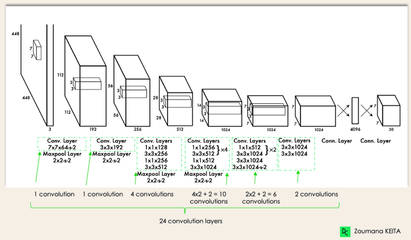
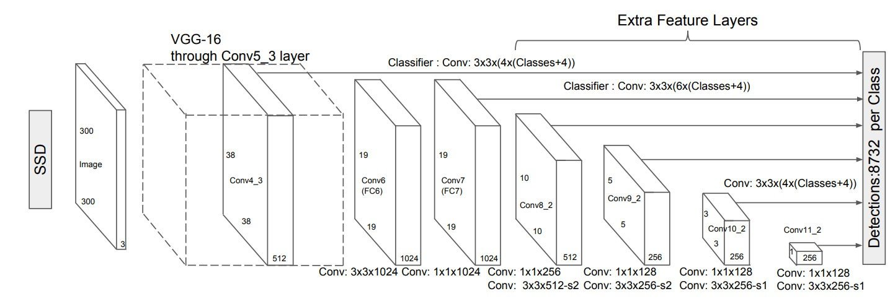

# Computer Vision Projects

Welcome to the **Computer Vision Projects** repository! This collection of projects demonstrates the power of computer vision techniques applied to real-world problems. From image classification to object detection, each project is designed to help you explore and learn the fundamentals of computer vision.

## Table of Contents
- [About](#about)
- [Projects](#projects)
- [Installation](#installation)
- [Usage](#usage)
- [Technologies Used](#technologies-used)
- [Contributing](#contributing)
- [License](#license)
- [Contact](#contact)

## About

This repository contains a diverse range of computer vision projects that utilize state-of-the-art models and libraries. Each project is structured with clean and well-documented code, making it easy to understand and replicate the results.

Whether you're a beginner looking to learn the basics or an experienced practitioner, these projects will help you deepen your knowledge of computer vision concepts such as image recognition, segmentation, and object detection.

## Projects

### 1. **Image Classification**
   - **Description**: A project that classifies images into predefined categories using convolutional neural networks (CNNs).
   - **Key Features**:
     - Utilizes transfer learning with pre-trained models.
     - Achieves high accuracy on various image datasets.
   - **Technologies Used**: Python, TensorFlow, Keras

### 2. **Object Detection**
   - **Description**: Detect and classify objects in images and videos in real time.
   - **Key Features**:
     - Implements YOLO and SSD models.
     - Real-time object tracking and bounding box creation.
   - **Technologies Used**: Python, OpenCV, PyTorch

### 3. **Image Segmentation**
   - **Description**: Segment different regions of an image using deep learning techniques.
   - **Key Features**:
     - U-Net architecture for accurate pixel-wise segmentation.
     - Applications in medical imaging, autonomous driving, etc.
   - **Technologies Used**: Python, PyTorch, OpenCV

_(Add additional projects here as needed)_

## Model Explanations

To better understand the working of these projects, here are some details on the key architectures:

### 1. **YOLO (You Look Only Once)**:

Most models perform object detection in two parts- they make predictions about the presence and then the location of the object in the image. As opposed to this, the YOLO architecture treats the tasks of object identification and classification as a single step. Hence, they are faster, making them suitable for real-time object detection. YOLO Architecture models are open source, so there is a supportive community out there that fosters the computer vision family. Read more [on the GitHub Page.](https://github.com/ultralytics/yolov5)

**How it Works**:
   - Image Division: The image is divided into an N x N grid, with each grid cell responsible for detecting objects within it.

   

   - Bounding Boxes and Class Scores: For each grid cell, YOLO predicts bounding boxes (coordinates, height, and width) and confidence scores. The confidence score indicates how likely an object is present.
   - Class Prediction: Each bounding box is assigned a probability for each class (like person, smoke, ball), indicating what type of object it likely contains.
Non-Maximum Suppression: Finally, YOLO applies a post-processing step to remove duplicate boxes, ensuring only the most accurate detections are kept.


**Applications of YOLO Architecture**: Owing to its high inference speed, it is used in video surveillance, self-driving cars, etc. (Fun fact: YOLOv3 was used during COVID-19 for estimating social distance violations in public.)

**The Future for YOLO**:

While the speed of YOLO is ideal, its limitations at present are its rigid grid system and lack of accuracy with small and crowded objects. Future versions may use dynamic grid systems adapted to scene complexity. Better feature extraction and context understanding can be done by the integration of transformer architectures and attention mechanisms. The next frontier for YOLO includes neural architecture search for optimal design and hardware-specific optimization. This would provide models that result in higher accuracy while keeping the computation cost at a minimum.

### 2. **SSD (Single Shot Multibox Detector) Model**:

This model, like YOLO, combines object detection and classification in a single step. The key difference is that it uses multiple layers to scan the image at different scales. The process consists of two parts- extraction of feature maps and applying convolution filters for object detection. Here is what the architecture looks like:



**Why use SSD?**: As compared to YOLO, the SSD model is better at detecting smaller or larger objects present in images accurately, even in complex scenarios. One should use this model if they want the perfect tradeoff between model accuracy and speed.

**How it Works**:
   - Image Division: A series of grids at multiple scales using several feature maps are used to divide the image. As mentioned above, the grids can detect objects of varying sizes.

   - Anchor Boxes: Each grid cell contains multiple anchor boxes of different shapes and sizes, guessing where an object might appear. Which the help of the boxes, one can predict multiple objects present the same area.

   - Class and Location Predictions: For each anchor box, SSD predicts the class and the precise location of the object.

   - Non-Maximum Suppression: To remove duplicate detections, it keeps only the most confident predictions to ensure accurate results.

**Applications of SSD Models**:

This model is best used for traffic monitoring (vehicle classification), manufacturing quality control (to detect minor defects in different types of products), and retail (instant inventory counts, crowded shelves with different items can be analysed too).

**The Future of SSD**

The future of SSD lies in the removal of dependence on its fixed feature pyramids and static default boxes. Adaptive architectures, that mould according to the features of their input, the static boxes as a learnable framework adapted to particular detection scenarios are some improvements to look for.
Another major improvement area is the enhancement of features through cross-layer interaction and semantic-aware fusion. Lightweight backbones and feature reuse strategies will efficiently reduce computational overhead with minimal loss in detection accuracy. Integration with edge computing and custom hardware accelerators will expand deployment possibilities. Learn more about [SSD Architecture here.](https://github.com/weiliu89/caffe/tree/ssd)

### 3. **U-Net**:

This convolutional Neural Network Architecture is used for image segmentation. This architecture is popular since it works well even on limited training data. U-Net was heavily used in the healthcare field (such as identifying tumors), but now is applied in various other domains as well. 

**Why use U-Net?**:

U-Net is particularly effective for tasks that require precise outline of objects as it can generate high-quality segmentation maps. The architecture allows it to retain important spatial information while downsampling, ideal for scenarios where fine detail is necessary, like in medical imaging or satellite imagery.

**How it Works**:

   - Two-Part Structure: U-Net consists of an encoder and a decoder. The encoder reduces the image's size and extracts important features. The decoder then enlarges this reduced representation back to the original size, focusing on reconstructing the details.

   - Skip Connections: This directly links the encoder and decoder layers, helping preserve important features lost during downsampling so that that the output retains necessary details for accurate segmentation.

   - Pixel-by-Pixel Classification: At the final stage, U-Net evaluates each pixel in the image to classify it into specific categories (like background, tumor, etc.).

**Applications of U-Net**:

Apart for being used in the medical field for tumor detection, organ segmentation and research in pathology, U-Net is also used in agriculture for weed detection and crop health monitoring; in image restoration where we remove noisy elements, and even in artistic applications to transfer and combine different styles or enhance features.

**The Future of U-Net**:

As U-Net continues to evolve, its integration with advanced techniques like generative adversarial networks (GANs) could enhance its capabilities in generating high-quality segmentation maps. You can also explore [this repository](https://github.com/milesial/Pytorch-UNet) to learn more about U-Net and its applications.


## Installation

To get started with any of these projects, clone this repository to your local machine:

```bash
git clone https://github.com/Aryan-Chharia/Computer-Vision-Projects.git
```

Then, navigate to the project directory and install the required dependencies:

```bash
cd <project-folder>
pip install -r requirements.txt
```

Make sure you have Python 3.8+ installed on your system.

## Usage

Each project contains detailed instructions in its respective folder. For general usage:

1. Navigate to the project folder.
2. Run the main script to start training/inference.
3. Follow the instructions in the README of each project.

Example for running an object detection model:

```bash
python object_detection.py --input <input_image_or_video>
```

## Technologies Used

- **Languages**: Python
- **Frameworks**: TensorFlow, PyTorch, Keras
- **Libraries**: OpenCV, Scikit-learn, Matplotlib, NumPy

## Contributing

We welcome contributions from the community! To contribute:

1. Fork the repository.
2. Create a new branch.
   ```bash
   git checkout -b feature-branch
   ```
3. Make your changes and commit
   ```bash
   git commit -m 'Add new feature
   ```
4. Push to the branch
   ```bash
   git push origin feature-branch
   ```
5. Open a pull request.
Check the [Contributing Guidelines](CONTRIBUTING.md) for more details.

## 👥 Our Valuable Contributors ❤️✨

Thanks to all the amazing people who have contributed to Computer-Vision-Projects! 💖

[](https://github.com/Aryan-Chharia/Computer-Vision-Projects.git)

## License

This repository is licensed under the MIT License. See the [LICENSE](LICENSE) file for more details.

<div align="center">
    <a href="#top">
        
    </a>
</div>
